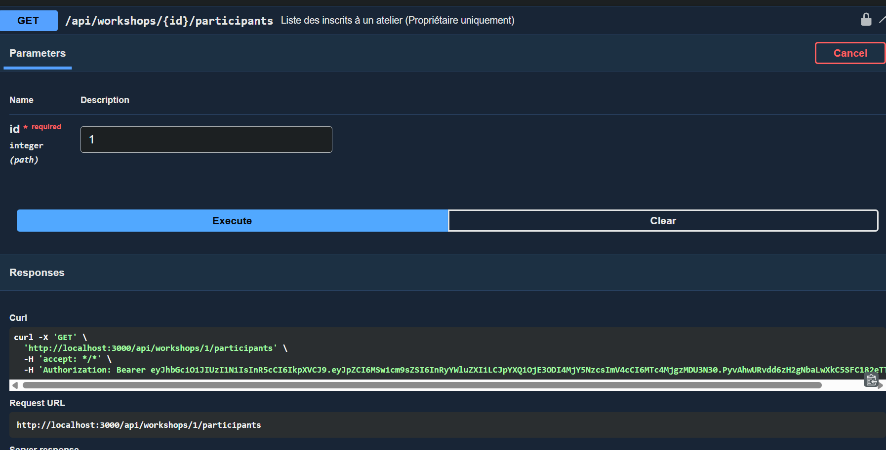
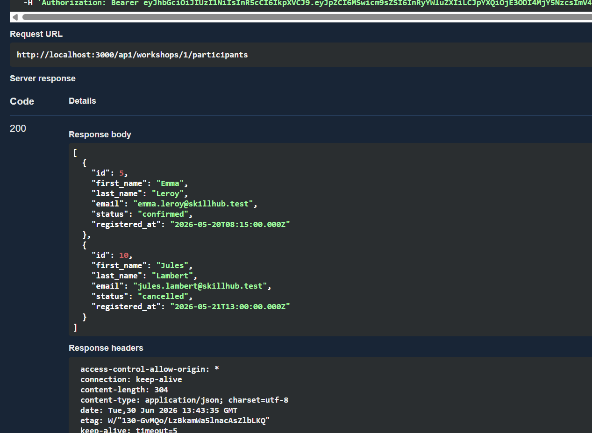
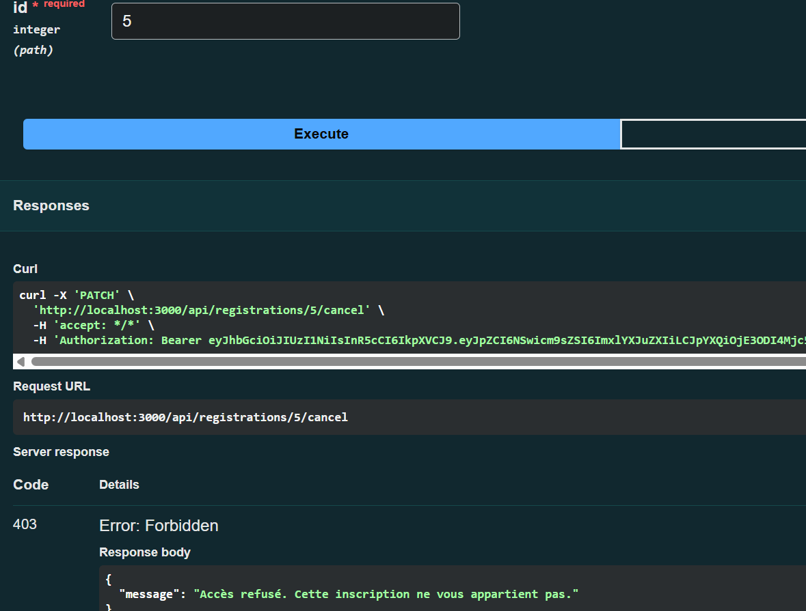
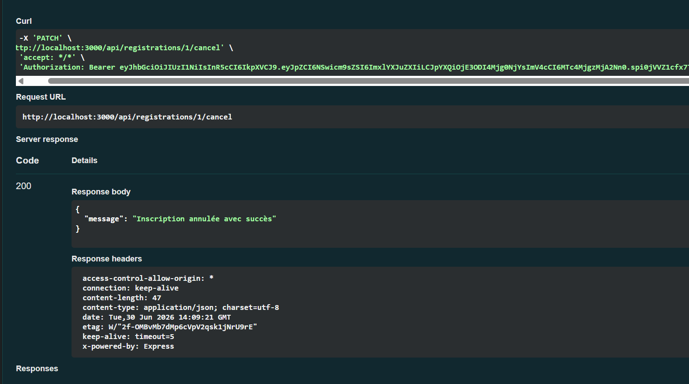

# Rapport - API SkillHub (EC04)

## 1. Stack Technique
Pour la réalisation de cette API, j'ai opté pour la stack suivante :
*   **Langage / Serveur** : Node.js
*   **Framework API** : Express.js (Choix justifié par sa légèreté, sa flexibilité et le fait qu'il s'agisse du standard de l'industrie pour les API en JavaScript).
*   **Base de données** : MySQL (déployée via Docker / docker-compose pour garantir un environnement isolé et reproductible). Les requêtes sont faites en SQL natif via `mysql2/promise`.
*   **Validation** : Joi (permet de valider très finement les payloads, équivalent à Zod).
*   **Authentification** : `jsonwebtoken` pour les tokens JWT et `bcryptjs` pour le hachage.

## 2. Sécurité
Le flux d'authentification est le suivant :
1.  L'utilisateur s'inscrit (`/api/auth/register`). Son mot de passe est haché avec Bcrypt (cost 12) avant insertion en base.
2.  L'utilisateur se connecte (`/api/auth/login`). Si les identifiants sont corrects, un JWT (valable **1 heure**) lui est retourné.
3.  Pour les requêtes protégées, le JWT doit être passé dans le header `Authorization: Bearer <token>`.

**Autorisations fines (Niveaux métiers) :**
*   **Niveau Propriétaire (Formateur)** : L'endpoint non-trivial retenu est `GET /api/workshops/{id}/participants`. Il permet de voir qui est inscrit à un atelier. **Seul le formateur ayant créé l'atelier** (ou un admin) peut y accéder.
*   **Niveau Propriétaire (Apprenant)** : L'endpoint `PATCH /api/registrations/{id}/cancel` permet d'annuler une inscription. **Seul l'apprenant concerné** peut réaliser cette action.

## 3. Documentation OpenAPI
La documentation OpenAPI (Swagger) est générée automatiquement grâce à `swagger-jsdoc` et exposée via `swagger-ui-express`.

**Pour démarrer le projet :**
1.  Démarrer la base de données : `docker-compose up -d` (Ceci va monter MySQL et injecter automatiquement les données de `skillhub.sql`).
2.  Installer les dépendances : `npm install`
3.  Lancer le serveur : `npm run dev`

**Accès à la documentation :**
Une fois le serveur lancé, la documentation interactive est accessible à l'URL : **`http://localhost:3000/api/docs`**
*(Note: Le fichier d'export `openapi.json` est disponible dans le dossier `docs/` de ce projet).*

Les tests Swagger sont disponibles en images dans le dossier `assets/captures_d_ecran`.

Pour l'authentification des routes protégées, il faut un token JWT et suivre le chemin suivant : 
Pour la route `GET /api/workshops/{id}/participants`, il faut se connecter avec l'email d'un formateur présent dans notre base `skillhub.sql`. On va procéder avec Marie : on récupère son JWT qu'on insère dans AUTHORIZE en haut du Swagger, et une fois connecté, on utilise son ID d'atelier (C'est le 1 pour Marie) et ça donne ça :

Pour la route `PATCH /api/registrations/{id}/cancel`, il faut le faire avec le compte d'une apprenante qui possède une inscription. Lorsque je teste avec Marie qui est une formatrice, j'ai eu une erreur 403, preuve que les authorisations fonctionnent ! 
 

On teste donc via Emma Leroy qui est une apprenante. On recupère son JWT, on le met dans AUTHORIZE en haut, et attention : dans la case id sur le swagger il faut mettre l'id de l'inscription (donc 1) et pas l'id de Emma (qui est 5) prck sinon on se reprend une 403 car on a pas le droit de toucher aux inscriptions des autres ! En mettant 1, l'inscription est bien annulée et ca donne ca :

## 4. Limites et Améliorations
A ameliorer les fonctionnalités suivantes : 
*   **Refresh Token** : Actuellement, le JWT expire après 1h. Il faudrait implémenter un système de *Refresh Token* pour éviter que l'utilisateur doive se reconnecter manuellement.
*   **Rate Limiting** : Protéger l'API contre le bruteforce (notamment sur les routes `/auth/login`) en limitant le nombre de requêtes.
*   **Tests Automatisés** : Ajouter une suite de tests avec Jest ou Supertest.
*   **Gestion centralisée des erreurs** : Mettre en place un middleware de capture d'erreurs globales au lieu des blocs `try/catch` répétitifs dans les contrôleurs.
